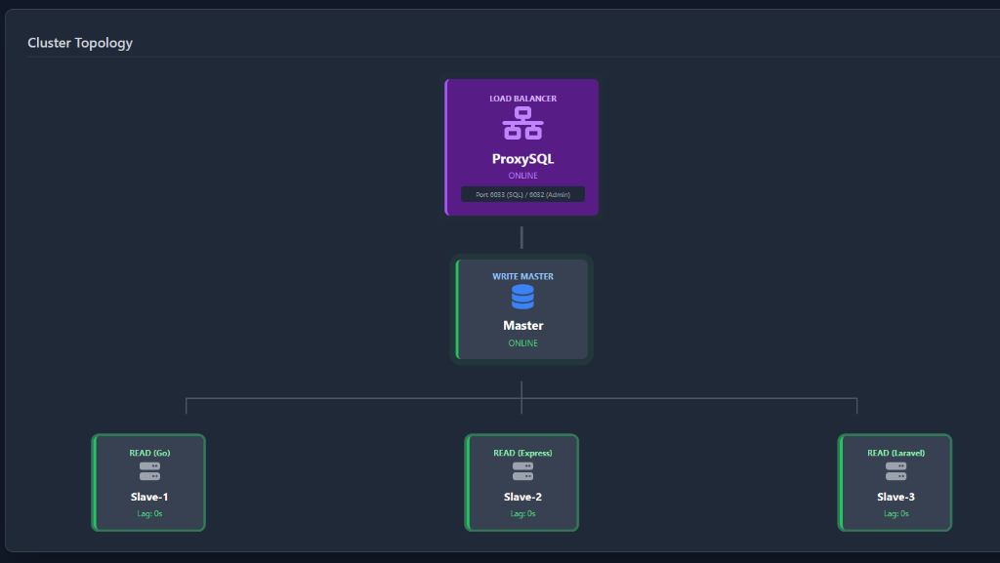

# MariaDB Cluster + ProxySQL (Docker)

A production-ready template for **MariaDB Master-Slave Replication** integrated with **ProxySQL** for intelligent Load Balancing and Read/Write splitting. Includes a visual dashboard for monitoring.

## Features
- **Master-Slave Topology**: 1 Master (Write), 3 Slaves (Read).
- **ProxySQL Integration**:
  - Automatically routes INSERT/UPDATE -> Master.
  - Automatically routes SELECT -> Slaves.
- **Visual Dashboard**: Real-time monitoring of node status and replication lag.
- **Dockerized**: One-click deployment.

## Installation

1. Clone this repository:
   ```bash
   git clone https://github.com/karimwafa/mariadb-cluster-plus-docker.git
   cd mariadb-cluster-plus-docker
   ```

2. Run the installer:
   ```bash
   chmod +x setup.sh
   ./setup.sh
   ```

3. Access the Dashboard:
   - URL: `http://localhost:5000`

## Architecture

- **ProxySQL**: Port 6033 (Data), 6032 (Admin)
- **Master**: Port 3306 (Internal)
- **Slaves**: Port 3306 (Internal)

## Project Structure
- `/cluster`: Database and ProxySQL configurations.
- `/dashboard`: Flask-based monitoring application.
- `/scripts`: Helper scripts for replication setup.
